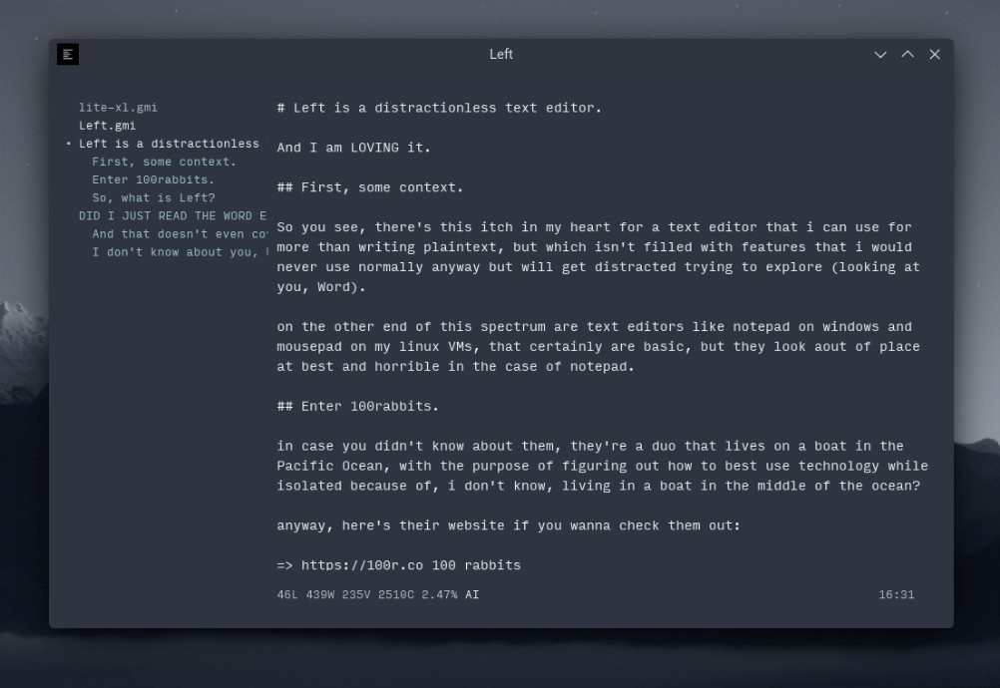

# So I finally have my verdict on Electron.js

It's good, and i'll learn how to use it.

## whaaaaat? weren't you into the whole minimalism thing? why electron?

one word: convenience.

---

okay, i need to give a better answer.

I think it should be very clear to anyone who knows anything about me that i don't know any sort of programming at all. on top of that, i use both linux and windows daily, and would like anything i make to be functional on both.

oh and also i'm a zoomer so i can't handle bad visual design; this means anything using native win32 is out.

### This automatically rules out Qt, since it uses win32 widgets and looks horrible in my eyes.

there's another problem with Qt: the only language i would want to write for Qt in is Python, and Python is a bit of a mess right now (will maybe write an article about it later?) <br>
anyway long story short is that Python with Qt is a complicated system on windows because windows is windows, and on linux it's complicated because Qt is Qt. i'm sure people can work around the difficulties i faced in less than an hour and continue on with it as if nothing happened, but i'm me so i'll solve the problem by shooting it out of existence.

## Enter Electron.

So one big problem with electron (apart from the whole memory usage situation which i'll address soon) is that it uses javascript, and javascript code looks like this:

```javascript
function changeMode() {
    var app = document.getElementsByTagName("BODY")[0];
    if (localStorage.getItem("lightMode") == "dark") {
        localStorage.setItem ("lightMode", "light");
        app.setAttribute("light-mode", "light");
    } else {
        localStorage.setItem ("lightMode", "dark");
        app.setAttribute("light-mode", "dark");
    }		
}
```

as you can see, it has an abundance of symbols that aren't text, and i have a bit of trouble trying to read stuff with a lot of symbols that aren't text (looking at you, maths) <br>
however, despite finding javascript very unreadable, i'll have to learn javascript for the following reasons:

- It's used for making webpages dynamic;
- It's used to make PWAs possible (and i have a bit of a soft spot for offline-first PWAs;
- It's a necessity for WebGL, which can get me properly started into OpenGL;
- And of course, electron.

### that doesn't explain the sudden support for electron though.

You're right, it doesn't. <br>
However, this will:

## Left is a distractionless text editor written in electron.

the repo is [this](https://github.com/hundredrabbits/Left), and it looks like this:



It's beautiful, has a unique feature-set, is blazing fast, and is the lightest electron app I've used.

#### it's even lighter than the electron hello world program.

I'm not joking. on windows (where electron tends to take less memory anyway), the hello world program took 78 megabytes of memory on my machine.

how much did Left take with two files open? 60 MB.

I don't know how Left manages that, but the codebase is pretty small and is written in vanilla Javascript, which means it should be easy for me to get into once i learn how to read Javascript.

## I hope now you realise why I suddenly decided electron ain't all that bad.

I realised that most of the problems of electron is that people are being too lazy with trying to optimise their application to run better on weaker hardware because fuck that, who cares about the guy who can't even buy a 600$ computer right? <br>
anyway, I have come to the realisation that if i wanna write something that's easy to port to both windows and linux while looking almost the exact same, i have two options:

1. using SDL and writing a native program from scratch (like lite-xl); or
2. simply using electron and not being lazy enough to make another slack. or signal desktop.

<br><br><br>
anyway that's enough for now lol
